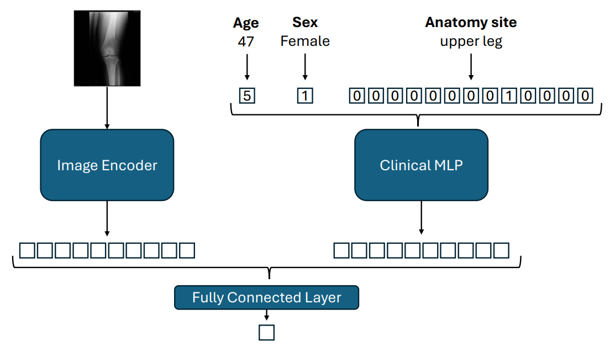
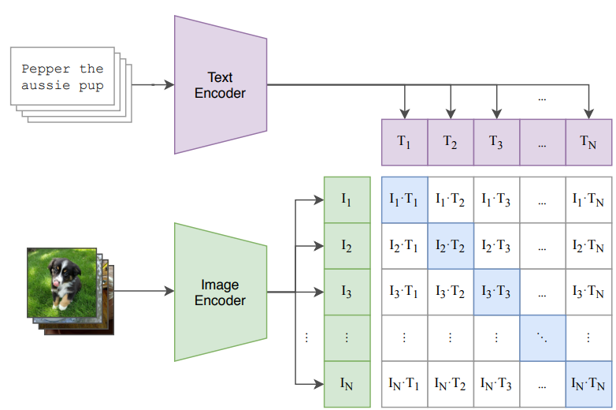

# Vision Language Pretraining for Bone Tumor Detection - Master's Thesis

- [Project Overview](#project-overview)
  - [Abstract](#abstract)
  - [Research Question](#research-question)
  - [Datasets](#datasets)
  - [Experiments](#experiments)
  - [Results](#results)
- [Development Setup](#development-setup)
  - [Create conda environment and install dependencies](#create-conda-environment-and-install-dependencies)
    - [Export conda environment to yaml file](#export-conda-environment-to-yaml-file)
  - [Set Up Pre-Commit (Optional)](#set-up-pre-commit-optional)
  - [Folder Structure](#folder-structure)
  - [Datasets](#datasets-1)
    - [INTERNAL](#internal)
    - [BTXRD](#btxrd)
    - [MURA](#mura)
    - [LERA](#lera)
  - [Env vars](#env-vars)
  - [Run an experiment](#run-an-experiment)
  - [Run a sweep](#run-a-sweep)
  - [Evaluate](#evaluate)
  - [(Slurm) Utils](#slurm-utils)
- [Copyright \& Licenses](#copyright--licenses)


## Project Overview

### Abstract

Fast and accurate bone tumor detection is crucial for prompt referral, diagnosis, and treatment.
However, delayed referral of more than a year occurs often in clinical practice.
Bone tumors can develop in many locations throughout the body, presenting a diagnostic difficulty.
Additionally, radiographic data of bone tumors is heterogeneous and scarcely available for clinical research.
Therefore, research on bone tumor detection is particularly focused on the knee.
Simultaneously, vision-language pretraining has shown advances in recent years.
This retrospective study examines multi-site bone tumor detection and investigates the impact of CLIP-like vision-language pretraining in this context.
For pretraining, the datasets MURA and LERA, designed for abnormality classification of radiographs, are combined, and text captions based on anatomy sites and abnormality labels are generated.
The downstream bone tumor dataset (7,007 samples; 3,625 tumor, 3,355 non-tumor) with 13 anatomy sites is derived from a combination of an internal dataset and the public BTXRD dataset.
Models are trained in two scenarios: Imaging, only using radiographic images, and Imaging+Clinical, additionally including sex, age, and anatomy site information with late fusion.
Vision-language pretraining is shown to be effective, despite artificially generated text and limited data.
Comparison to a baseline shows an increase in AUROC of 0.04 (Imaging) and 0.01 (Imaging+Clinical), respectively.
Benchmarking the proposed method against a supervised chest x-ray model pretrained with approximately seven times more data reveals the superiority of the supervised model, with a difference in AUROC of 0.08 (Imaging) and 0.03 (Imaging+Clinical), respectively.
Overall, the AUROC of 0.72 of an Imaging baseline is increased to 0.94 with an Imaging+Clinical chest x-ray model, demonstrating the feasibility of multi-site bone tumor detection.

### Research Question

In a nutshell, our research tries to answer the question:

**What is the effect of anatomy-aware vision-language pretraining on bone tumor
detection?**

The awareness of the anatomy site is of interest, since the bone tumor detection is applied to radiographic images from across the body. As additional goals, we want to investigate bone tumor detection in a multi-site setting and compare anatomy-aware vision-language pretraining with a SOTA pretrained model

### Datasets

This project uses 4 datasets:
 - "Our" INTERNAL dataset
 - [MURA](https://arxiv.org/abs/1712.06957)
 - [LERA](https://doi.org/10.71718/aqrb-et67)
 - [BTXRD](https://doi.org/10.1038/s41597-024-04311-y)

Our INTERNAL dataset contains radiographic images of patients with and without bone tumors and clinical information (e.g. age, sex, anatomy site, etc.).
The BTXRD dataset also contains radiographic images of patients with and without bone tumors and clinical information.
We combine these two datasets into the **Downstream** dataset for the bone tumor detection task.

The MURA and LERA datasets contain radiographic images with and without abnormailities and anatomy site information.
We combine these two datasets into the **Pretrain** dataset for the anatomy-aware vision-language pretraining task.
By feeding a LLM with the binary abnormality label and the anatomy site, we generate captions for the images to be used in the VLP task.

### Experiments

For training on the Downstream dataset, we consider two scenarios:
1. Using only the radiographic images (Imaging)
2. Using the radiographic images and age, sex, anatomy site information (Imaging+Clinical)

The fusion approach for Imaging+Clinical is depicted in the figure below:
<p align="left">
  
</p>


We train two baselines from scratch for each scenario:
- [ResNet34](https://doi.org/10.48550/arXiv.1512.03385)
- [NesT-Small](https://doi.org/10.48550/arXiv.2105.12723)

As focus of this project, we pretrain a ResNet34+[TinyBert](https://doi.org/10.48550/arXiv.1909.10351) using CLIP-like vision-language pretraining (VLP) on the Pretrain dataset.
For vision language pretraining, we mimic [CLIP](https://doi.org/10.48550/arXiv.2103.00020), which is coarsely depicted in the figure below (screenshot from their paper).
During training, we evaluate the linear probe performance on the Downstream dataset by freezing the ResNet34 image encoder, passing the downstream data through it and training a logistic regression on the resuling feature embeddings.
Then, we finetune the pretrained ResNet34 on the Downstream dataset for both scenarios.
<p align="left">
  
</p>


Additionally, we finetune a [Torchxravision](https://github.com/mlmed/torchxrayvision) ResNet50 on the Downstream dataset for both scenarios.
In total, we conduct 9 experiments:

```
ResNet34:
  - Downstream Dataset - Imaging
  - Downstream Dataset - Imaging+Clinical

NesT-Small:
  - Downstream Dataset - Imaging
  - Downstream Dataset - Imaging+Clinical

ResNet34+TinyBert:
  - Pretrain Dataset → Linear Probe on Downstream Dataset - Imaging
  - Pretrain Dataset → (discard TinyBert) → Downstream Dataset - Imaging
  - Pretrain Dataset → (discard TinyBert) → Downstream Dataset - Imaging+Clinical

ResNet50 (Torchxrayvision):
  - Downstream Dataset - Imaging
  - Downstream Dataset - Imaging+Clinical
```

Using a naming convention of `<Experiment Type> <Model> <Scenario>`, the experiments are named as follows:
```
Scratch Baseline ResNet34 Imaging
Scratch Baseline ResNet34 Imaging+Clinical
Scratch Baseline NesT-S Imaging
Scratch Baseline NesT-S Imaging+Clinical
VLP Linear Probe ResNet34 Imaging
VLP Finetune ResNet34 Imaging
VLP Finetune ResNet34 Imaging+Clinical
Torchxrayvision Finetune ResNet50 Imaging
Torchxrayvision Finetune ResNet50 Imaging+Clinical
```

### Results

Test performance across experiments. Results of 4-fold cross-validation are
averaged and represented with mean ± standard deviation. ↑ and ↓ indicate
whether the baseline from scratch is outperformed. Bold values indicate the highest performance
in that metric and setting (Imaging and Imaging+Clinical)

| **Experiment**              | **Model**     | **Acc**               | **Prec**              | **Rec**               | **AUROC**             |
|-----------------------------|---------------|-----------------------|-----------------------|-----------------------|-----------------------|
| **Imaging**                 |               |                       |                       |                       |                       |
| Scratch Baseline            | ResNet34      | 0.65±0.018            | 0.68±0.037            | 0.63±0.130            | 0.72±0.020            |
| Scratch Baseline            | NesT-S        | 0.66±0.013            | 0.67±0.018            | 0.69±0.033            | 0.72±0.007            |
| VLP Linear Probe (ours)     | ResNet34      | ↓0.61±0.006           | ↑0.70±0.009           | ↓0.43±0.031           | ↓0.66±0.013           |
| VLP Finetune (ours)         | ResNet34      | ↑0.68±0.008           | ↑0.73±0.040           | ↓0.62±0.071           | ↑0.76±0.014           |
| Torchxrayvision Finetune    | ResNet50      | ↑**0.75±0.004**       | ↑**0.76±0.005**       | ↑**0.76±0.021**       | ↑**0.84±0.007**       |
| **Imaging+Clinical**        |               |                       |                       |                       |                       |
| Scratch Baseline            | ResNet34      | 0.82±0.008            | 0.86±0.006            | 0.78±0.025            | 0.90±0.011            |
| Scratch Baseline            | NesT-S        | 0.80±0.005            | 0.81±0.023            | 0.80±0.037            | 0.89±0.005            |
| VLP Finetune (ours)         | ResNet34      | ↑0.83±0.013           | ↓0.83±0.024           | ↑**0.84±0.037**       | ↑0.91±0.012           |
| Torchxrayvision Finetune    | ResNet50      | ↑**0.87±0.010**       | ↑**0.89±0.020**       | ↑**0.84±0.017**       | ↑**0.94±0.007**       |


## Development Setup

### Create conda environment and install dependencies

Create the conda environment and install dependencies:

```bash
conda env create -f environment.yaml
```


#### Export conda environment to yaml file

If you want to export the conda environment to a yaml file, run:

```bash
conda env export > environment.yaml
```

> NOTE: since torch is installed with an index url, this also needs to be specified in the environment.yaml under the pip section. So you have to run the following command afterwards to add it to the file:

```bash
awk '/pip:/ {print; print "      - --extra-index-url https://download.pytorch.org/whl/cu118"; next} 1' environment.yaml > tmp.yml && mv tmp.yml environment.yaml
```

Or you simple do both in one line:

```bash
conda env export > environment.yaml && awk '/pip:/ {print; print "      - --extra-index-url https://download.pytorch.org/whl/cu118"; next} 1' environment.yaml > tmp.yml && mv tmp.yml environment.yaml
```

### Set Up Pre-Commit (Optional)

I created two pre-commit hooks to make development easier and not accidentally upload sensitive images in a notebook.
1. export conda environment to environment.yaml plus adding the extra index url for torch
2. clear jupyter notebooks from their output before committing them
   
To set up pre-commit, run:

```bash
pre-commit install
```

### Folder Structure

Coarse:
```bash
├── configs # hydra configurations folder
├── notebooks
├── README.md # the file you are currently reading :D
├── scripts # scripts to run test evaluations, pre-commit hooks, and more
├── slurm # slurm scripts to be ran on the cluster
└── src
    ├── data # code for data loading and processing
    ├── models # code for models of all experiments
    ├── train.py # main entry point to train any model with a hydra config
    └── utils # utilities used for model training or evaluation afterwards
```


<details>
 <Summary>Detailed</Summary>
 
```bash
├── configs # hydra configurations folder
│   ├── callbacks
│   ├── data
│   │   ├── downstream.yaml
│   │   └── pretrain.yaml
│   ├── experiment # experiment configurations, these are the combined configurations to run an experiment
│   │   ├── baseline_imaging_and_clinical
│   │   ├── baseline_imaging_and_clinical_pretrained
│   │   ├── baseline_only_imaging
│   │   ├── baseline_only_imaging_pretrained
│   │   ├── finetune_imaging_and_clinical
│   │   ├── finetune_only_imaging
│   │   └── pretrain
│   ├── model
│   │   ├── fusion.yaml
│   │   ├── only_imaging.yaml
│   │   └── vision_language.yaml
│   ├── optimizer
│   │   ├── adamw.yaml
│   │   └── adam.yaml
│   ├── scheduler
│   ├── sweeps # sweep definitions
│   └── train.yaml
├── datacache # cache to store mean and std of datasets folds for normalization and test set hashes for ensuring same test set
├── evaluation # csv files with evaluation results
├── model_checkpoints # best model checkpoints of all experiments
├── notebooks
│   ├── EDA
│   │   ├── EDA_BTXRD.ipynb
│   │   ├── EDA_INTERNAL.ipynb
│   │   ├── EDA_INTERNAL_non_tumor.ipynb
│   │   ├── EDA_LERA.ipynb
│   │   ├── EDA_MURA.ipynb
│   │   ├── Visualizations_DOWNSTREAM.ipynb
│   │   └── Visualizations_PRETRAIN.ipynb
│   ├── Evaluation
│   │   └── downstream.ipynb
│   └── Understanding_BERT.ipynb
├── predictions # csv files with model probabilites (similar to evaluation folder, but here no metrics have been computed yet, this is just raw model outputs), I needed this for confusion matrix plotting
├── README.md # the file you are currently reading :D
├── LICENSE # license file
├── sbom.json # software bill of materials listing third party libraries used in this project
├── ATTRIBUTION.md # attribution file listing third party libraries and their licenses
├── thesis.pdf # the master's thesis
├── res # generated captions for VLP pretraining
├── scripts
│   ├── create_sweep_from_config.sh # script to create a sweep from a sweep config file
│   ├── dicom_to_png.py
│   ├── export-conda-env.sh # used by pre-commit to export conda env to environment.yaml
│   ├── jupyter-nb-clear-output.sh # used by pre-commit to clear jupyter notebook outputs
│   ├── linear_probe_test_eval_downstream.py # test eval script for linear probe experiment (files in evaluation and predictions folder are generated with this script)
│   ├── sweep_config_to_latex_table.py # helper for writing thesis to generate latex table from sweep config
│   ├── sweep_ids_to_best_hparam_latex_table.py # helper for writing thesis to generate latex table from sweep ids
│   └── test_eval_downstream.py # test eval script on the downstream dataset (files in evaluation and predictions folder are generated with this script)
├── slurm
│   ├── run_any_python_script.sh # helper script to run any python script on slurm with one gpu
│   ├── submit_and_follow.sh # helper script to run an hydra config experiment on SLURM and follow the logs directly
│   ├── sweep_submit_and_follow.sh # helper script to start a sweep agent and follow the logs directly
│   ├── test_setup.sh
│   ├── train.sh # script to run src/train.py on slurm
│   └── train_sweep.sh # script to run a wandb sweep agent on slurm
├── src
│   ├── data # code for data loading and processing
│   │   ├── BTXRDDataset.py
│   │   ├── DownstreamDataModule.py # combining BTXRD and INTERNAL datasets for downstream task
│   │   ├── INTERNALDataset.py
│   │   ├── KFoldCVDataModule.py # interface definition for Downstream and Pretrain Datasets
│   │   ├── LERADataset.py
│   │   ├── MURADataset.py
│   │   ├── PretrainDataModule.py # combining LERA and MURA datasets for pretraining task
│   │   ├── helpers
│   │   │   ├── caption_generator.py
│   │   │   ├── caption_regenerate_missing.py
│   │   │   ├── encoding.py # encoding of clinical features
│   │   │   ├── ensure_same_test_set.py # helper to ensure same test set across experiments by hashing
│   │   │   ├── hash_list_of_dicts.py
│   │   │   └── internal_btxrd_combination.py # helper for a combined representation of anatomy sites of INTERNAL and BTXRD dataset
│   │   ├── sampler
│   │   │   └── UniqueCaptionSampler.py
│   │   ├── transform
│   │   │   ├── CropLargerDimension.py
│   │   │   ├── DropChanneld.py
│   │   │   └── PadToSquaredEdgeAverage.py
│   ├── models # code for models of all experiments
│   │   ├── baseline
│   │   │   ├── FusionModule.py
│   │   │   └── OnlyImagingModule.py
│   │   └── pretrain
│   │       └── VisionLanguageModule.py
│   ├── setup_test.py # test script to verify that torch, wandb, hydra, lightning, and cuda is set up correctly
│   ├── train.py # main entry point to train any model with a hydra config
│   └── utils # utilities used for model training or evaluation afterwards
│       ├── coral_loss
│       │   └── coral.py
│       ├── hyperparam_logging.py
│       ├── instantiators.py
│       ├── LinearProbeCallback.py
│       ├── MetricSnapshotCallback.py
│       └── plotting
│           ├── plot_confusion_matrix.py
│           └── plot_tsne_and_calculate_silhouette.py
└── visualizations
    ├── data
    │   ├── downstream
    │   └── pretrain
    └── results
```
</details>

### Datasets

#### INTERNAL

Store the data in a folder and point the environment variable `INTERNAL_DATASET_PATH` to it.
The folder must contain the following files and folders:
```
healthy_subset_new_cleaned.csv - contains file, age, sex, anatomy_site, patient_id of newly added healthy patients
healthy_subset_new - folder containing x-ray images in .png-format referenced by file in healthy_subset_new_cleaned.csv
included_patients.xlsx - contains image (filename), rad_FallNr, pat_nr, age_initialdiagnosis, entity, localisation_old, sex, year_initialdiagnosis, side, localisation_1, localisation_2, epi, direction, xtl, ytl, xbr, ybr, img_w, img_h, pseudo accnr of patients of the INTERNAL dataset as given at the start of the thesis
initial_images - folder containing x-ray images in .png-format refereced by image column in included_patients.xlsx
```

#### BTXRD

Please download the [BTXRD dataset](https://figshare.com/articles/dataset/A_Radiograph_Dataset_for_the_Classification_Localization_and_Segmentation_of_Primary_Bone_Tumors/27865398?file=50653575)  and unzip the folder.
Point the environment variable `BTXRD_DATASET_PATH` to the folder `BTXRD`.

Additionally, Yu Qiao labeled the anatomy site for the healthy images, so make sure to additionally copy the file `res/data/downstream/BTXRD_healthy_anatomy_sites.xlsx` into the `BTXRD` folder.

#### MURA

Please download the [MURA dataset](https://stanfordaimi.azurewebsites.net/datasets/3e00d84b-d86e-4fed-b2a4-bfe3effd661b) and unzip the folder.
Point the environment variable `MURA_DATASET_PATH` to the folder `MURA-v1.1`.

#### LERA

Please download the [LERA dataset](https://stanfordaimi.azurewebsites.net/datasets/44a63ddf-edd8-46cb-b021-094bb8efb802) and unzip the folder.
Point the environment variable `LERA_DATASET_PATH` to the folder `LERA Dataset`.


### Env vars

Huggingface transformers and Matplotlib are bitching around because of a tmp dir, so I set some env vars for them.
If you want to use the wandb logger, you should add your wandb api key.
Also, add the environment variables for the datasets.
Below are my environment variables listed as an example.

Please make sure these environment variables are set (e.g. add them to your `.bashrc` or configure your IDE accordingly):

```bash
export HF_HOME=/mnt/nfs/homedirs/benjamins/transformers_cache/
export MPLCONFIGDIR=/mnt/nfs/homedirs/benjamins/.config/matplotlib

export WANDB_API_KEY=<your_wandb_api_key>

export INTERNAL_DATASET_PATH=/mnt/nfs/homedirs/benjamins/DATA/
export BTXRD_DATASET_PATH=/mnt/nfs/homedirs/benjamins/btxrd_dataset/BTXRD/
export MURA_DATASET_PATH=/mnt/nfs/homedirs/benjamins/muramskxrays/MURA-v1.1/
export LERA_DATASET_PATH=/mnt/nfs/homedirs/benjamins/lera_dataset/LERA\ Dataset/
```

### Run an experiment

First, create an experiment file under `configs/experiment/my_experiment.yaml` (or simply use one of the present ones).

> You can also create subfolders under the `experiment`-folder, but make sure to include the subfolder when refering to the experiment
> e.g. you created an experiment `configs/experiment/baseline/my_experiment.yaml` -> refer to it with `baseline/my_experiment`

To run it using SLURM do:
```bash
sbatch --export=ALL,EXPERIMENT=my_experiment slurm/train.sh
```

If you want to submit it and directly follow the logs, you can use the script `submit_and_follow.sh` instead:

```bash
./slurm/submit_and_follow.sh my_experiment
```


### Run a sweep

First, create a sweep config file under `configs/sweeps/my_sweep.yaml` (or simply use one of the present ones).
To create the sweep, run:

```bash
./scripts/create_sweep_from_config.sh <wandb_project> configs/sweeps/my_sweep.yaml
# for example:
./scripts/create_sweep_from_config.sh benjamin-schuster/vision-language-bone-tumor-finetune-imaging-and-clinical configs/sweeps/vlp_finetune_imaging_and_clinical_sweep.yaml
```
This will create the sweep and provide you with instructions on how to start a sweep agent:
```bash
# You can now run the sweep with the following command:
# Replace <COUNT> with the number of runs you want or leave it empty to run until stopped."
sbatch --export=ALL,SWEEP=<sweep_id>,COUNT=<COUNT> slurm/train_sweep.sh
# OR: You can also use the following command to submit the sweep and follow the logs:
# Replace <COUNT> with the number of runs you want or leave it empty to run until stopped.
./slurm/sweep_submit_and_follow.sh <sweep_id> <COUNT>
```


### Evaluate

The best model checkpoints of all experiments are stored in the folder `model_checkpoints/`.
The result of the evaluations are stored in the folder `evaluation/` and visualizations can be viewed in `notebooks/Evaluation/downstream.ipynb`.

In case you want to **re-run** the evaluations, you can use the following commands:

> NOTE: you can run those evaluations on the cluster by using the script `run_any_python_script.sh` (explained in SLURM utils): `sbatch ./slurm/run_any_python_script.sh <copy-command-from-below-without-"python">`

> NOTE: for more information on the evaluation scripts, refer to the output of `python scripts/test_eval_downstream.py --help` and `python scripts/linear_probe_test_eval_downstream.py --help`

```bash
# Imaging Baseline ResNet34
python scripts/test_eval_downstream.py evaluation/baseline/only_imaging_baseline_resnet34.csv w35jazgq 0ehxsmnz j40y2f6f gvzsd5ko
# Imaging Baseline Nest Small
python scripts/test_eval_downstream.py evaluation/baseline/only_imaging_baseline_nest_small.csv yovxq4fh 52xo243y 1d6jd9ly hyrc0zjc
# Imaging Baseline Pretrained ResNet50
python scripts/test_eval_downstream.py  --torchxrayvision evaluation/baseline_pretrained/only_imaging_pretrained_baseline_resnet50.csv brql1a2f nxdiz9a7 5bfek4st j2lw8rta
# Imaging Linear Probe ResNet34
python scripts/linear_probe_test_eval_downstream.py evaluation/vlp/linear_probe_only_imaging_resnet34.csv py9knd36
# Imaging Finetune ResNet34
python scripts/test_eval_downstream.py evaluation/finetune/only_imaging_finetune_resnet34.csv 0dm6en33 g0cdcnbi qkka5asc kpu5pq4m


# Imaging+Clinical Baseline ResNet34
python scripts/test_eval_downstream.py evaluation/baseline/imaging_and_clinical_baseline_resnet34.csv yaqufo4u riq99k4u p1qwavbm e3t8s4e7
# Imaging+Clinical Baseline Nest Small
python scripts/test_eval_downstream.py evaluation/baseline/imaging_and_clinical_baseline_nest_small.csv 3tcjngei adp8nki0 ria8l9hd la3aa99n
# Imaging+Clinical Baseline Pretrained ResNet50
python scripts/test_eval_downstream.py  --torchxrayvision evaluation/baseline_pretrained/imaging_and_clinical_pretrained_baseline_resnet50.csv bjzz6xf0 5ujnnxy7 qxr7p5cl a67xkti2
# Imaging+Clinical Finetune ResNet34
python scripts/test_eval_downstream.py evaluation/finetune/imaging_and_clinical_finetune_resnet34.csv gixclsfz 0t31lt3v e66b93j7 11tb2jmc
```


### (Slurm) Utils

```bash
# SLURM
# -------------------------------
# Run an experiment on SLURM
sbatch --export=ALL,EXPERIMENT=<experiment_name> ./slurm/train.sh
# Run an experiment on SLURM and follow the logs directly
./slurm/submit_and_follow.sh <experiment_name>
# Run a wandb sweep agent on SLURM
sbatch --export=ALL,SWEEP=<sweep_id>,COUNT=<COUNT> ./slurm/train_sweep.sh
# Start a wandb sweep agent on SLURM and follow the logs directly
./slurm/sweep_submit_and_follow.sh <sweep_id> [number of runs]
# Run any python script on slurm with one gpu
sbatch ./slurm/run_any_python_script.sh <path_to_script.py> [additional args for the python script]
# Test setup script to verify that torch, wandb, hydra, lightning, and cuda is set up correctly
sbatch ./slurm/test_setup.sh

# Other Utils
# -------------------------------
# Create a sweep from a sweep config file, it will provide information on how to start a sweep agent afterwards
./scripts/create_sweep_from_config.sh <wandb_project> <path_to_sweep_config.yaml>
# Export conda environment to environment.yaml (used by pre-commit)
./scripts/export-conda-env.sh
# Clear jupyter notebook outputs (used by pre-commit)
./scripts/jupyter-nb-clear-output.sh <path_to_notebook.ipynb>
```

## Copyright & Licenses

Copyright (c) 2025 Benjamin Alexander Schuster

This work is licensed under the MIT License as specified in the [``LICENSE``](LICENSE) file.
This license does **not** cover any external training data, datasets, or model weights that may be used or referenced by this software.
Thereby also any visualizations of images from datasets are not covered by this license.

Countless third party libraries are used in this project. A Software Bill of Materials (SBOM) was generated using the [Cyclone DX python package](https://pypi.org/project/cyclonedx-bom/).

To give credit where credit is due, based on the SBOM an [``ATTIRBUION.md``](ATTRIBUTION.md) was generated listing the licenses of the third party libraries.
It was generated by [FOSSA](https://app.fossa.com/).
